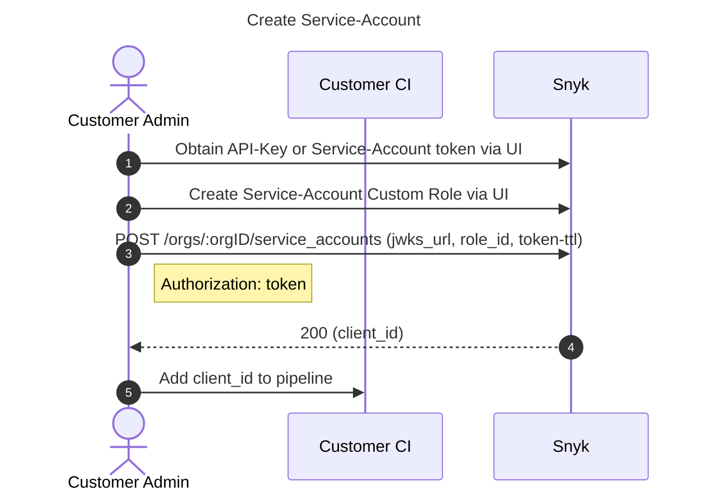
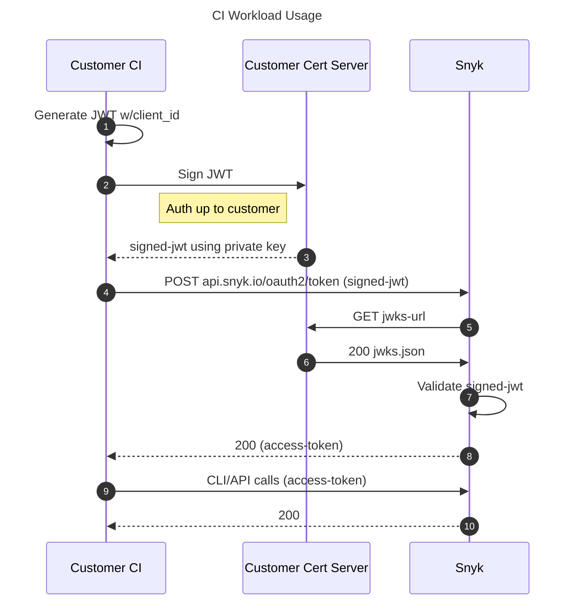

# Service Account OAuth Demo

This demo shows how to create and use a Snyk service-account with the [`client_credentials` OAuth grant](https://datatracker.ietf.org/doc/html/rfc6749#section-4.4).

These accounts use the `private_key_jwt` form of `client_assertion` for authentication (as defined in the [OIDC Core 1.0 spec](https://openid.net/specs/openid-connect-core-1_0.html#ClientAuthentication)), vs typical `client-secret`. This allows customers to rotate their private signing key at will.

Refer to API documentation for [`service_account` create/delete](https://apidocs.snyk.io/?version=2022-07-08~experimental#tag--ServiceAccounts) and [OAuth2 token fetching](https://snykoauth2.docs.apiary.io/#reference/apps/app-tokens/token-exchange-&-refresh).

## Call-outs 📣

These are detailed below, but we want to make it clear that in our current iteration, creating a service-account requires:

1. A traditional API Key (tied to a human user, or a traditional service-account). These can't be revoked via the API itself (but can be manually via the UI) and don't expire.
1. A manual step to create a custom role for the new service-account, which is currently UI only. This role can be reused across many service-accounts, however.

For production use, customers will need to provide:

1. Public/private key infrastructure
1. Publicly accessible JWKS endpoint hosting the public keys
1. Tool/script that will:
    1. Build private_key_jwt with client-id and other required fields
    1. Sign jwt with a private key (security between your tool & key infrastructure is up to the customer)
    1. Call `/oauth2/token` endpoint to get an `access-token`
    1. Make access-token available to Snyk CLI via the `SNYK_OAUTH_TOKEN` env var

## Flow overview

## Usage Steps

This demo is split into several parts, to mimic how service-accounts would typically be used within client systems. It requires python - see "Python Setup Help" below for assistance.

### 1. Key Infrastructure 🔑

This section represents the required public/private key infrastructure with associated JWKS hosting, which the customer will need to provide themselves in production.

1. Generate private signing key and start JWKS server: `python 01_host-jwks.py`
1. Expose this JWKS endpoint to the internet. We suggest [localtunnel](https://localtunnel.github.io/www), or [pagekite](https://pagekite.net). Note: endpoint _must_ be served over HTTPS.

### 2. Account Creation 🤖

This section is done once per needed service-account. The number of accounts created are up to the customer, whether it's one per use-case, or a single one shared across an org. We recommend more granular in usage scope.

1. Fill in the settings file:
    1. `cp settings.template.ini settings.ini`
    1. `api_token`: Snyk API Token from the [Snyk account page](https://app.dev.snyk.io/account) (alternatively, create a traditional [Snyk service account](https://docs.snyk.io/features/user-and-group-management/structure-account-for-high-application-performance/service-accounts) and use its API Token)
    1. `role_id`: [Create a custom role](https://docs.snyk.io/features/user-and-group-management/managing-users-and-permissions/member-roles#create-a-role) and grab its `ID` value when done
    1. `org_id`: The Organization ID from the settings page of the desired owning org: `https://app.dev.snyk.io/org/{YOUR_ORG_NAME}/manage/settings` (or click the cog in the upper right from within the Snyk UI)
    1. `jwks_url`: Internet accessible URL for the above JWKS server (eg the localtunnel URL if you used that)
1. Create the service-account: `python 02_create-service-account.py`

**Note:** The Snyk Org used above will need a certain feature flag applied. Please contact Snyk to have it set up.

### 3. Workload Usage 💁

This section mimics a backend workload, such as a CI/CD Pipeline, and how it'd obtain an `access-token` for a given service-account to use with the Snyk API or CLI.

1. Get an access-token (such as in a CI Pipeline): `export token=$(python 03_get-access-token.py)`

Use the `access-token`:

* Snyk API: `curl "https://api.snyk.io/rest/orgs?version=2022-04-06~experimental" -H "Authorization: bearer $token"`
* Snyk CLI: `SNYK_OAUTH_TOKEN="$token" snyk test`

### (Optional) 4. Account Deletion 🔥

This step doesn't _need_ to be run, but it helps keeps things tidy 🙂

1. Remove the created service account: `python 04_delete-service-account.py`

## Python Setup Help 🐍

Here's one option to setup & run the required python version/dependencies (alternatively try [poetry](https://python-poetry.org)):

1. Install [pyenv](https://github.com/pyenv/pyenv) and its [virtualenv](https://github.com/pyenv/pyenv-virtualenv) plugin
1. Install pinned python: `pyenv install $(cat .pyenv)`
1. Use that version: `pyenv shell $(cat .pyenv)`
1. Setup a virtual env: `pyenv virtualenv $(basename $PWD)`
1. Activate the virtual env: `pyenv activate $(basename $PWD)`
1. Install requirements: `pip install -r requirements.txt`
